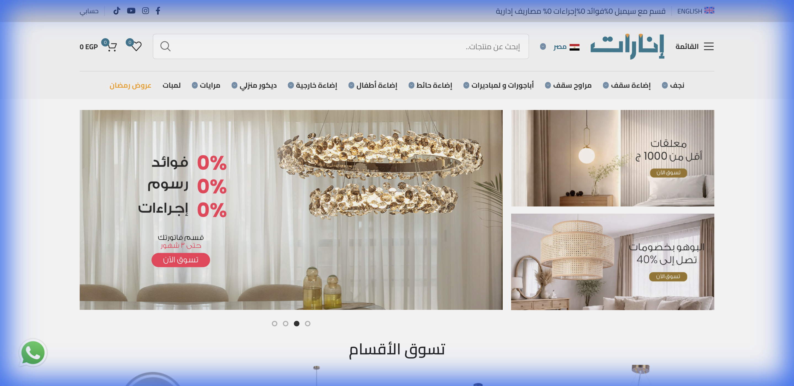
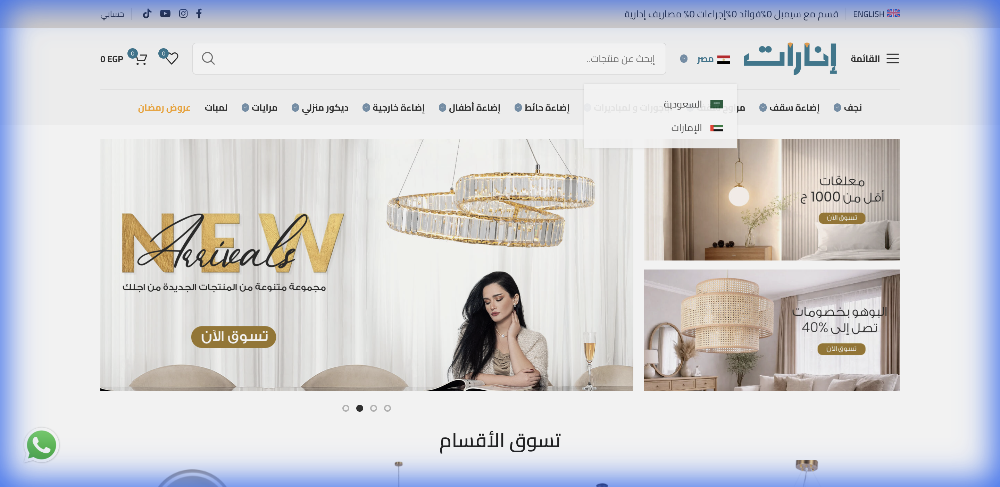

# 03-Competitor Scan: Visual Evidence & Analysis

**CONFIDENTIAL | Prepared by: Admireworks**
**Client Contact:** Mahmoud
**Date:** February 10, 2026

---

## 1. Primary Competitor: enarat.com

### Homepage — Professional Marketplace UX

*The #1 online lighting marketplace in MENA. Clean UX, prominent installment messaging (Sympl, 0% interest), seasonal campaigns (Ramadan), and WhatsApp floating button. Operating in Egypt, Saudi Arabia, and UAE.*

### Country Switcher — Regional Expansion

*Active markets: 🇪🇬 Egypt, 🇸🇦 Saudi Arabia, 🇦🇪 UAE. Localized pricing per market (EGP / SAR / AED). Dedicated subdomains (sa.enarat.com, enarat.ae).*

### Product Page — eCommerce Best Practices

*Harbiz 15-Bulb Chandelier: 8,949 EGP (was 17,305 — 48% off). Key elements: Sympl installments (5 × 1,342 EGP), social proof ("20 sold in 3 hours"), scarcity ("Only 2 left"), 1-year warranty, 14-day returns.*

---

## 2. Competitive Gap Analysis

### What enarat.com Does Well
| Strength | Detail |
| :--- | :--- |
| Catalogue Scale | Massive range: chandeliers, ceiling, outdoor, kids, mirrors, bulbs |
| Regional Reach | Egypt + KSA + UAE with localized warehouses & pricing |
| Payment Flexibility | Sympl 0% installments, multiple payment methods |
| Social Proof | Real-time "X sold" counters + low stock urgency |
| UX Quality | Fast, clean, professional ecommerce |

### Where enarat.com Falls Short (Our Attack Surface)
| Weakness | Our Response |
| :--- | :--- |
| **No Styling/Consultation** — just a catalogue to browse | "Lighting Stylist" quiz + bookable consultations |
| **No Room Visualization** — can't see lights in context | AR "See It In Your Room" tool |
| **No Editorial Content** — zero blog, zero guides, zero education | "Lighting Academy" + Before/After gallery |
| **Generic Support** — WhatsApp = helpdesk, not expert advice | Named stylists, video call consultations |
| **No B2B/Project Division** — retail only | Dedicated "Projects KSA" arm for hospitality |
| **Return Friction** — customer pays shipping on returns | "Safe Arrival Guarantee" (free replacement) |

---

## 3. Secondary Competitors

### Kandil Egypt
*   **Position:** Heritage manufacturer, trusted Egyptian brand
*   **Strength:** 30-day return policy (market-leading), manufacturing credibility
*   **Weakness:** Industrial feel, poor digital storytelling, no consultation
*   **Threat Level:** Medium — they make products, we curate experiences

### Asfour Crystal
*   **Position:** Global luxury crystal icon
*   **Strength:** Perceived luxury, gifting market
*   **Weakness:** Crystal-only (niche), no KSA shipping from Egypt site, ignoring modern trends
*   **Threat Level:** Low — different market segment

### Homzmart
*   **Position:** Egypt's "Amazon of Home"
*   **Strength:** Scale, bundling, aggressive pricing
*   **Weakness:** Low trust for fragile/premium items, reviews cite breakage, cluttered UX
*   **Threat Level:** Medium for budget segment, low for high-ticket

### IKEA Egypt
*   **Position:** Functional, mass-market design
*   **Strength:** Brand trust, room planning tools
*   **Weakness:** Cookie-cutter designs, no luxury positioning, not for villas
*   **Threat Level:** Low — entirely different customer

---

## 4. Strategic Positioning Map

```
     PREMIUM
        ↑
        |     Asfour ★
        |               [OUR POSITION] ★
        |                   "Lighting Stylist"
        |
        |     Kandil ★
        |                    enarat.com ★
 NARROW ←————————————————————————————→ WIDE
CATALOG |                               CATALOG
        |     IKEA ★
        |                Homzmart ★
        |
        ↓
     BUDGET
```

**Our target position:** Premium service + wide curation (best of all suppliers) — occupying the gap between Asfour's luxury niche and enarat.com's mass catalogue.
